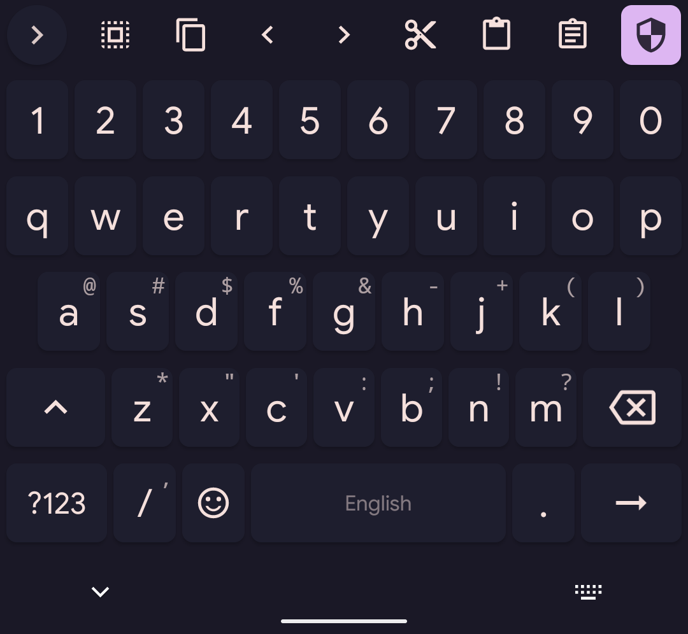

<h3 align="center">
	 
	
	Catppuccin for <a href="https://github.com/florisboard/florisboard">FlorisBoard</a>
	
</h3>

    
    
    

## USAGE

1. Download the file
2. Open the app
3. Change to Theme
4. Under night theme selected theme
5. Click on the `+` icon
6. Import
7. Select the file

## 🙋 FAQ

- Q: **_"More about the App"_**
- A: The github for the app is [here](https://github.com/florisboard/florisboard)

## 💝 Thanks to

- [Mirage](https://github.com/skinatro)
