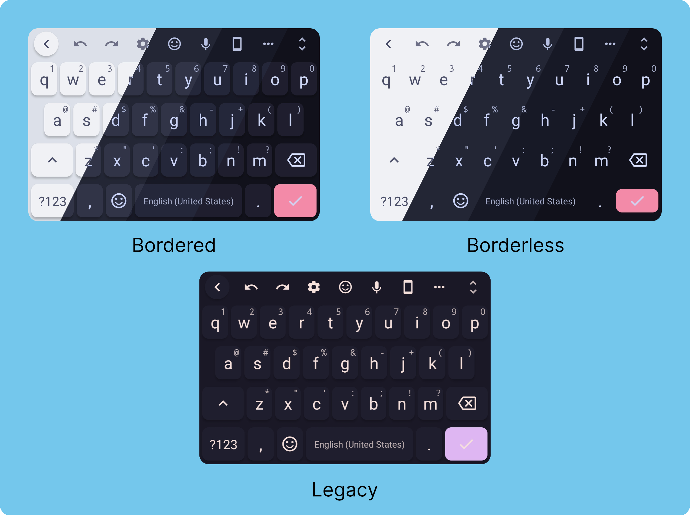

<h3 align="center">
	 
	
	Catppuccin for <a href="https://github.com/florisboard/florisboard">FlorisBoard</a>
	
</h3>

    
    
    

	

## USAGE

1. Download the file ([Releases](https://github.com/catppuccin/floris-board/releases/newest))
2. Open the app
3. Click on Theme
4. Click on `Manage Installed Themes`
5. Import
6. Click on `Select files`
7. Select the file in the file manager
8. It will display the theme info and click on `Import`
9. Select the flavour you want!

## 🙋 FAQ

- **_"More about the App"_**
	- The github for the app is [here](https://github.com/florisboard/florisboard)

- **_"Which flavours does it comes with?"_**
	- It comes with all 4 currently available flavours (Latte,Macchiato,Mocha and Frappe) with bordered and borderless versions and it also comes with a special Catppuccin 1.0 theme as well!

- **_"I want to change the Enter key colour"_**
	- See Editing Instruction

##	Editing the theme

Go to `Manage Installed Themes` , Click on `Edit` under Catppuccin and then edit your desired colorscheme.

To change the enter key colour , set the `Primary Color` key to your desired color and if you want to make it match the background(make it borderless) then change `Key code = [10]` value from `Primary Color` to `Common Surface`

## 💝 Thanks to

- [Mirage](https://github.com/skinatro)
- [winston](https://github.com/nekowinston) 

&nbsp;

Copyright &copy; 2021-present <a href="https://github.com/catppuccin" target="_blank">Catppuccin Org</a>

