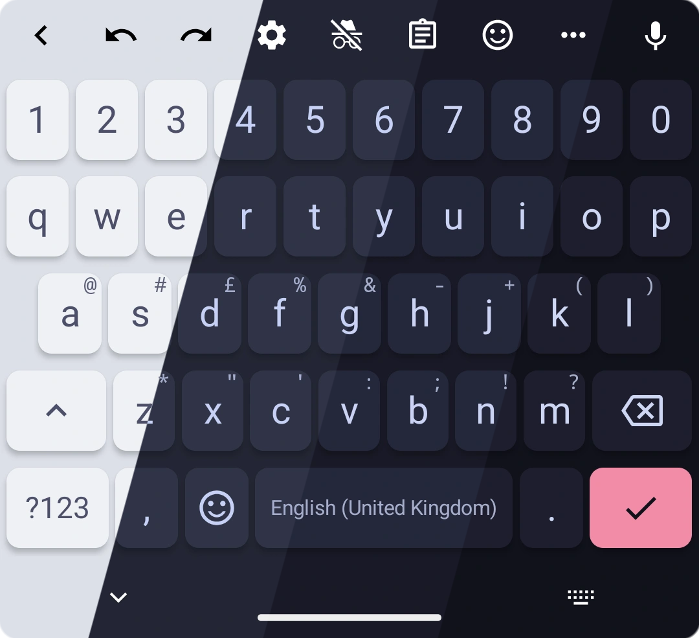
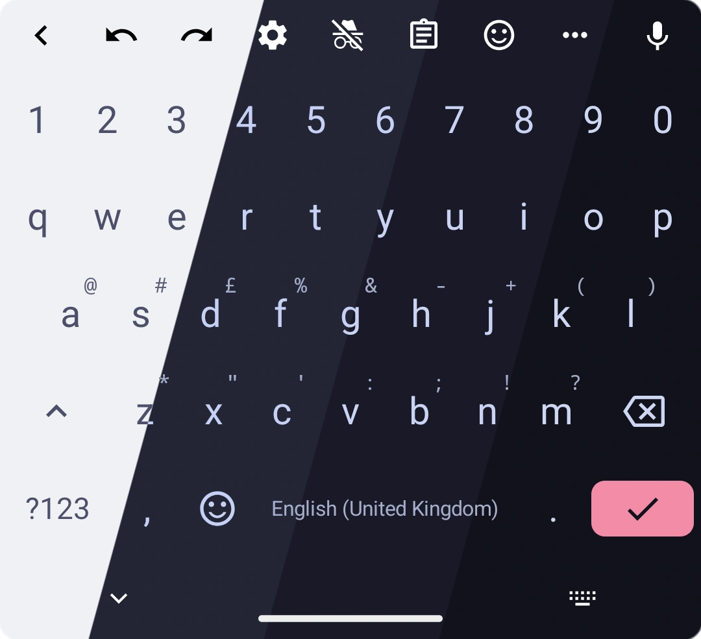
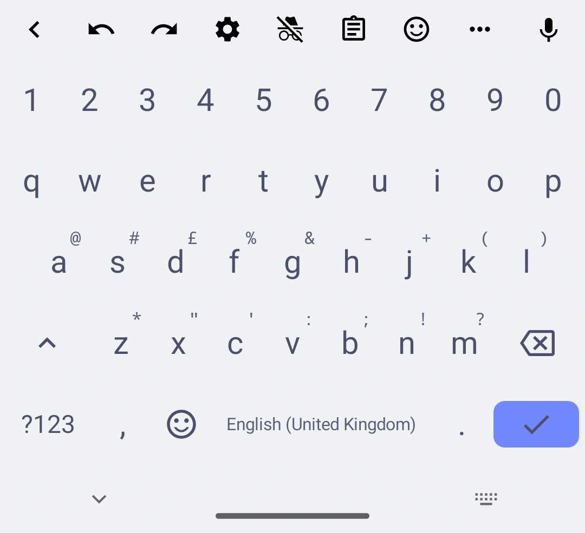
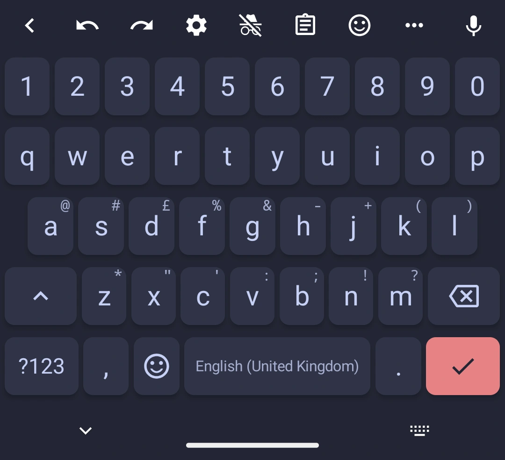
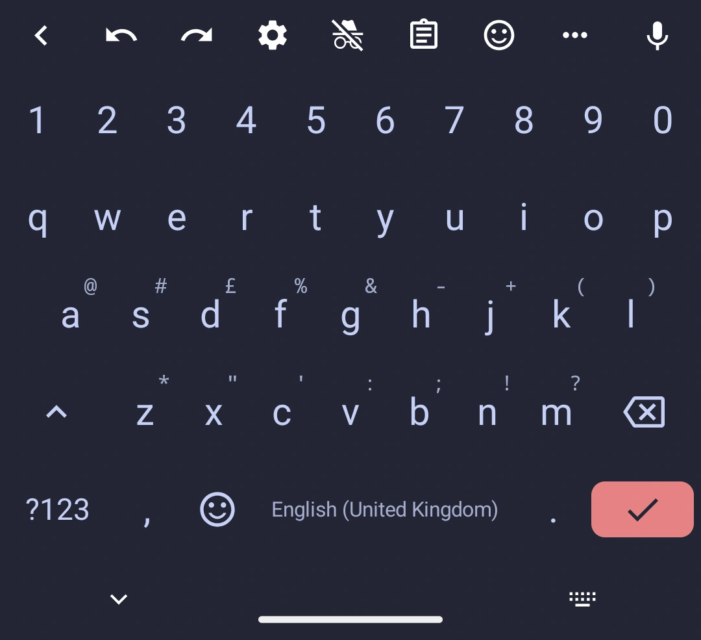
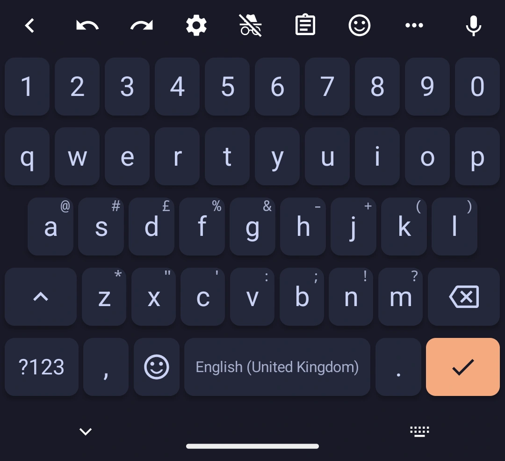
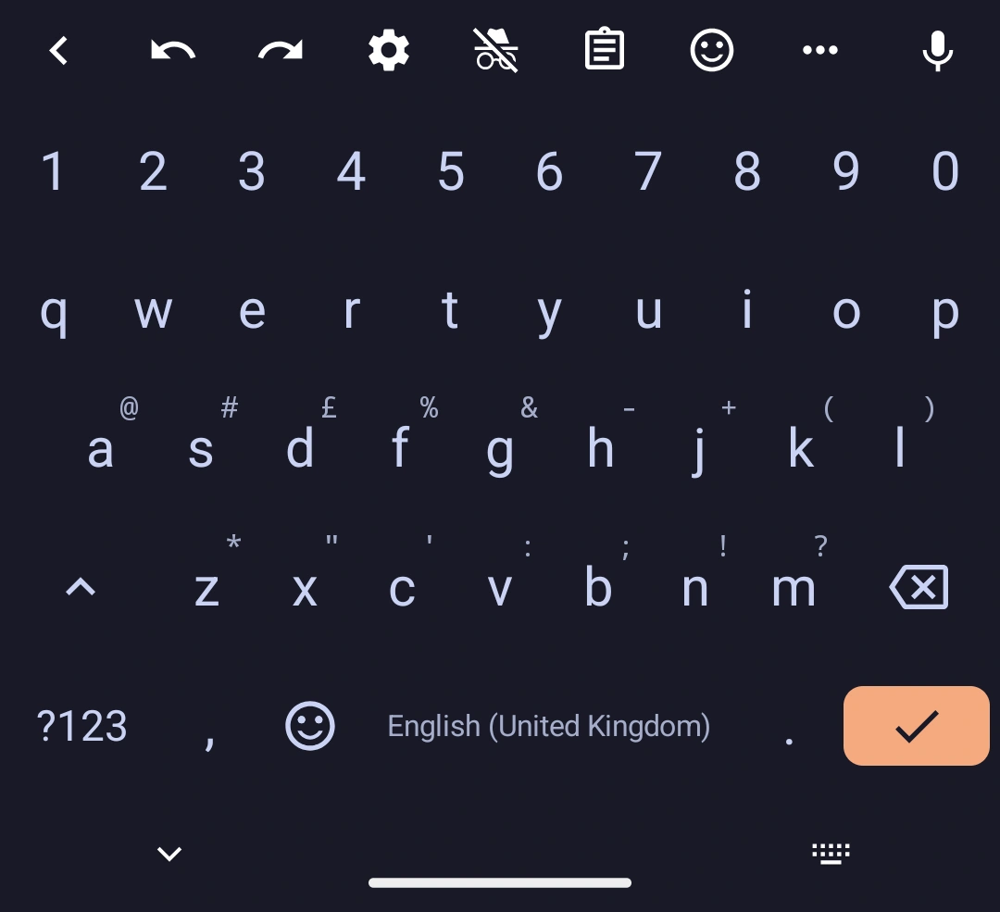
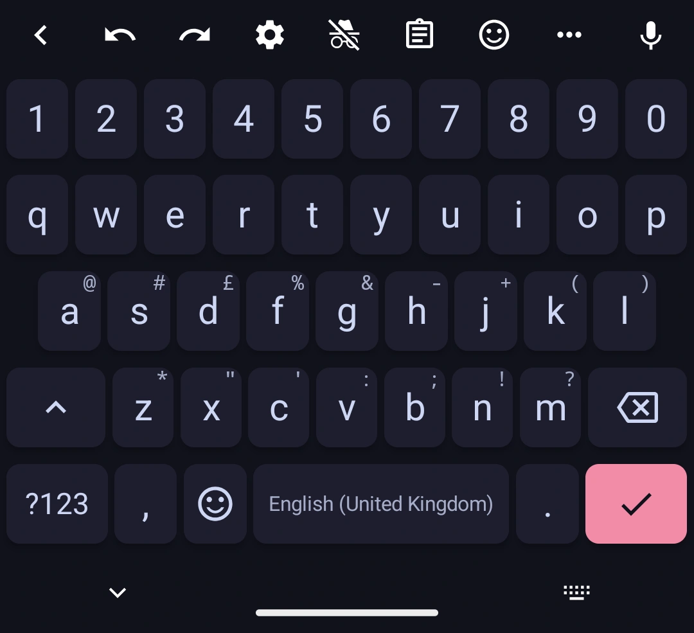
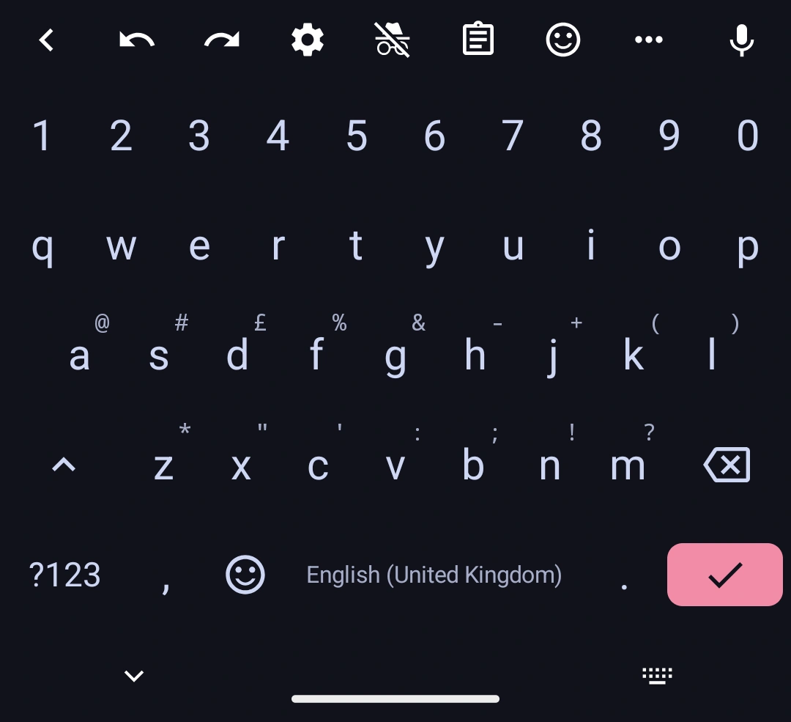

<h3 align="center">
	 
	
	Catppuccin for <a href="https://github.com/florisboard/florisboard">FlorisBoard</a>
	
</h3>

    
    
    

  
  

## Previews

🌻 Latte

🪴 Frappé

🌺 Macchiato

🌿 Mocha

## Usage

### Add-ons Store (Recommended)

1. Visit the [FlorisBoard Add-ons Store](https://beta.addons.florisboard.org/).
2. Search for `Catppuccin`.
3. Click download and import the extension with the FlorisBoard app.

### Manual

1. Download the `.flex` file from [GitHub Releases](https://github.com/catppuccin/florisboard/releases/latest).
2. Open the FlorisBoard app.
3. Click `Addons & Extensions`.
4. Click `Import`.
5. Select the downloaded `.flex` file.
6. After verifying that you can see list of Catppuccin themes, click `Import`.
7. Head back to the main menu, click `Theme`, and select the Catppuccin theme you want to use for both Day and Night mode.

## Editing the Theme

1. Go to `Addons & Extensions` in FlorisBoard app.
2. Click `Theme extensions`.
3. Press `Edit` on Catppuccin.
4. Edit your desired flavour(s).

For example, to change the enter key colour, set the `Primary Color` key to your
desired color.

If you want to make it match the background (i.e. make it borderless) then
change `Key code = [10]` value from `Primary Color` to `Common Surface`

## 💝 Thanks to

- [Mirage](https://github.com/skinatro)
- [winston](https://github.com/nekowinston)

&nbsp;

Copyright &copy; 2021-present <a href="https://github.com/catppuccin" target="_blank">Catppuccin Org</a>

